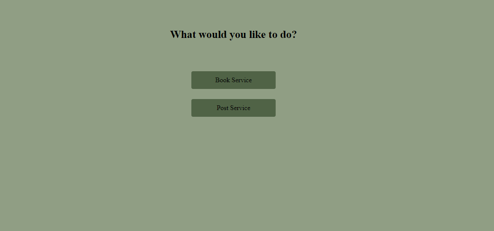
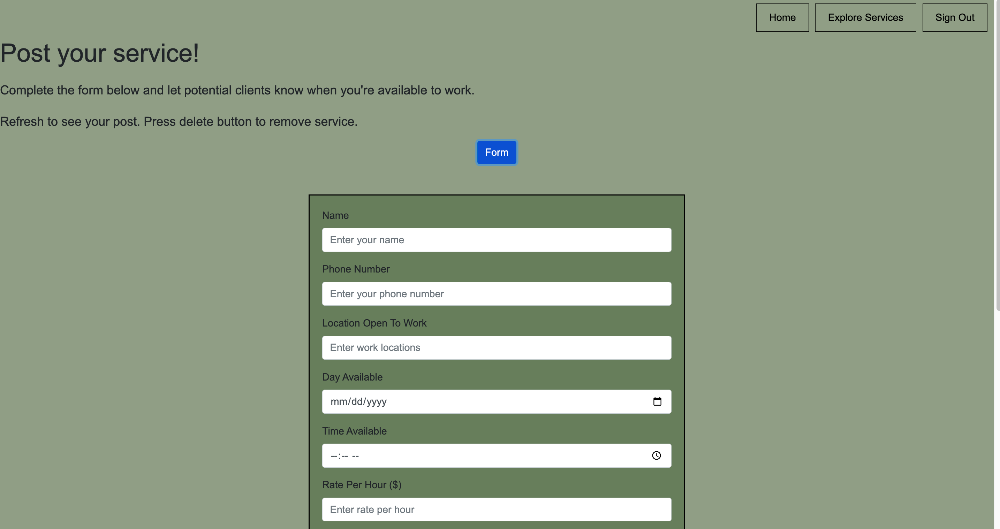
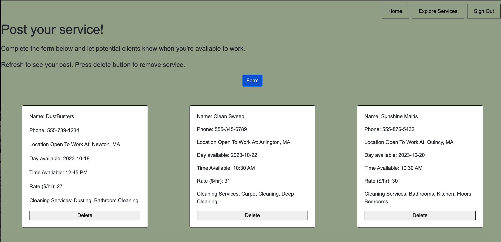
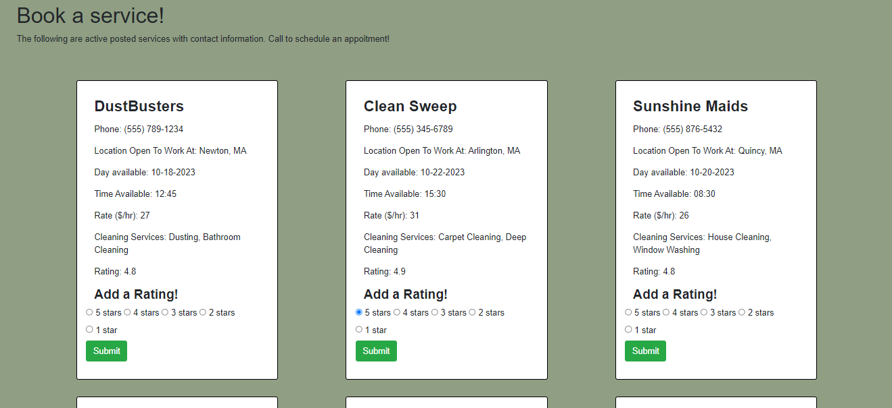

# Housekeeping Service App

## Overview

- **Authors**: Eduardo Puerta and Vicki Diaz

## Project Information/ Links:

- **Deployed page**: https://housekeeping-service.onrender.com/

- **Walkthrough Video**: https://youtu.be/BjB2eFNvoXw

- **Slides**: https://docs.google.com/presentation/d/1Oa3BdZ2WB9zYL-O41pdDc7k0UPlX7rSQSdthu8VpPs8/edit?usp=sharing

- **Design Document**: [Click to view the design document PDF](designDoc/CS5610_Project2.pdf)

- **Class Link**: https://johnguerra.co/classes/webDevelopment_fall_2023/

## Objective:

This app allows housekeeping service providers to post their services to connect them to people seeking housekeeping. The app provides a platform for both service providers and consumers. The app implements a basic signing up system, and provides users with the choice to see services to book or to post appointments. Posting a service connects to a database that lets other users see it in the booking area. Finally, users can provide ratings to appointments based on their experience.

## Functionalities:

- Landing Page:
  - Welcomes user to application and gives option to login or sign up
- Create an account:
  - user is able to sign up and user credentials to sign back in.
- Create Service:
  - user is able to create a service
  - can add name, phone number, location, day and time availability, hourly rate, and what services they provide. This gets logged into the database of available services.
  - user is able to delete a service they created
- Book Service:
  - lets a user see available services side to side to compare for their preferences and gives information to call provider
- Rating system:
  - user can rate thier experince with a service, which updates the rating in the database

## Installation:

- clone this repository to local machine

```
git clone https://github.com/epuer18/HousekeepingService
```

- run `npm install`` to build packages and install dependencies

```
npm install
```

- add a .env file to the directory and make a `MONGO_URL` variable with the `uri` to connect to the right MongoDB Atlas database.

  - This site was developed with a database in MongoDB Atlas, to use the same database contact the authors with your IP number so that it can be added onto the permissions. Similarly, to prevent others from overusing these resources, we share a private key at our discression.
  - Otherwise you can create your own MongoDB Atlas project with a database named `HousekeepingApp` and two collections: `users` and `services`.

```
MONGO_URL = "mongodb+srv://<username>:<password><info_database_cluster>"
```

- finally run the application locally with `npm start`

```
npm start
```

## Technologies Used:

- JavaScript (ES6)
- HTML
- CSS

- MongoDB
- Node.js
- Express.js

## Screenshots of App

Below we show some screenshots of the site's main pages, and a brief description on how to navigate.

1. First we start on a landing page that asks us to sign up. Since this project aims to demonstrate the use of MongoDB and node express to build a backend we ask that you **DO NOT** use real credentials for this step.


2. After logging in or signing up, you can choose to add a service entry to the database or see the available services to book them. Click on the corresponding button.



3. For the Posting section, open the form and fill with relevant details.



4. Once form is filled and submitted, all details will be displayed. A delete option is given if you wish to delete your service. It will also remove from the booking section.



5. For the booking section, see what services are available and make sure to call whichever you like best. Afterwards come back and add a rating so other users can see which services are good!


